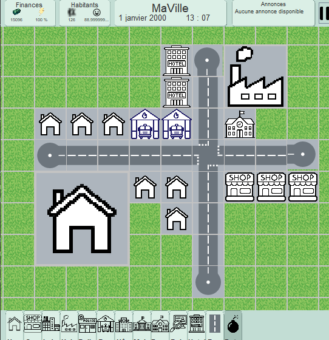
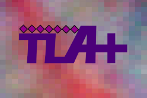

<!--
### Hi there 👋

**priprou1/priprou1** is a ✨ _special_ ✨ repository because its `README.md` (this file) appears on your GitHub profile.

Here are some ideas to get you started:

- 🔭 I’m currently working on ...
- 🌱 I’m currently learning ...
- 👯 I’m looking to collaborate on ...
- 🤔 I’m looking for help with ...
- 💬 Ask me about ...
- 📫 How to reach me: ...
- 😄 Pronouns: ...
- ⚡ Fun fact: ...
-->

<h1 align="center">Hi 👋, I'm Priscilia Gonthier !</h1>
<h4 align="center">I'm a software engineer, soon to be graduate from ENSEEIHT (École National Supérieure d’Électrotechnique, d’Électronique, d’Informatique, d’Hydraulique et de Télécommunications) in Digital Sciences.</h4>

<!--
<h3 align="left">My projects at ENSEEIHT:</h3>

City Builder

 
  

Within a team of 7 students we have built a game of the type city-builder like sim-city. The aim of the project was to coordinate all our team in order to build a whole application in java during 4 months.
   
   
  You can find the source code here.

-->

<h3 align="left">🤝 Connect with me:</h3>

<h3 align="left">💻 Programing Languages:</h3>

 

  
  
  
  
  
  
  
  
  
  

  <!--
  
  
  
  <a href="https://developer.mozilla.org/fr/docs/Web/HTML" target="_blank" rel="noreferrer"> 
  <a href="https://developer.mozilla.org/fr/docs/Web/CSS" target="_blank" rel="noreferrer"> 

   
  
  
  <a href="https://lamport.azurewebsites.net/tla/tla.html" target="_blank" rel="noreferrer"> 
<a href="http://www.gprolog.org" target="_blank" rel="noreferrer"> 

  -->

<h3 align="left">🛠️ Tools:</h3>

 
  
  
  
  
  
  
  
  
  
  

  <!--
   
   
  
  
-->

